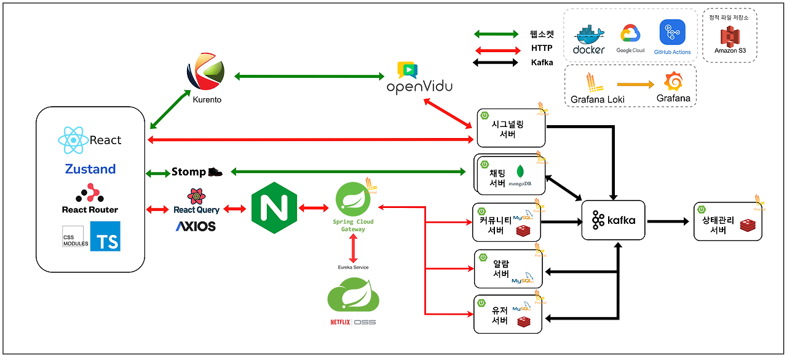

# FitTrip

- 캡스톤 프로젝트 2024 - FitTrip
- 개발 기간 : 2024.03 ~ 2024.06

2024 강원대학교 캡스톤 프로젝트에서 진행한 헬스 중심의 커뮤니티 플랫폼 FitTrip입니다! 
주요 기능들은 Discord 기능들을 클론 했습니다. 
백엔드 개발자 4명은 MSA구조에서 각자 서로 다른 서비스를 맡아 진행했습니다. 
자세한 내용은 각 [서버](#역활-분담)와 [Docs](./docs/)를 참고 해주세요.

## 로고

## 팀 소개

- 저희 팀은 총 백엔드 4명 프론트 2명으로 이루어진 팀입니다.

<table align="center">
    <tr align="center">
        <td><B>안재진<B></td>
        <td><B>이예지<B></td>
        <td><B>유다인<B></td>
        <td><B>한윤수<B></td>
        <td><B>민진홍<B></td>
        <td><B>최유성<B></td>
    </tr>
    <tr align="center">
        <td>
            
             
            <a href="https://github.com/acs0209"><I>acs0209</I></a>
        </td>
        <td>
            
             
            <a href="https://github.com/yeahzee0421"><I>yeahzee0421</I></a>
        </td>
        <td>
            
             
            <a href="https://github.com/ryudain05"><I>ryudain05</I></a>
        </td>
        <td>
            
             
            <a href="https://github.com/HanYoonSoo"><I>HanYoonSoo</I></a>
        </td>
        <td>
          
             
            <a href=https://github.com/minhong1126"><I>minhong1126</I></a>
        </td>
        <td>
            
             
            <a href="https://github.com/youcastle03"><I>youcastle03</I></a>
        </td>
    </tr>
</table>

## 기술 스택

### Frontend

- React, Javascript
- Zustand
- styled-components
- Stomp.js

### Backend

- Language
  - Java 17
- Spring Framework
  - Spring Boot 3.2.x 
  - WebSocket, STOMP, SockJS
  - Netflix Eureka Server
  - Netflix Eureka Client
  - Spring Cloud Gateway
  - OpenFeign
  - WebClient
  - Kafka
- Database
  - MySQL
  - MariaDB
  - MongoDB
  - Redis
  - H2
- Object Storage
  - Amazon S3 
- Infra
  - Docker
  - NGINX
  - Kafka
  - Grafana
  - Loki
- CI/CD
  - Git
  - Github Actions
  - GCE(Google Compute Engine)
- OpenSource
  - OpenVidu 

## 전체 아키텍처

## 역할 분담
### Backend
#### 안재진

- 채팅 서비스
- 상태관리 서비스
- EDM(Event Driven MicroService) 아키텍처, Kafka 토픽 설계

#### 한윤수

- 커뮤니티 서비스
- MSA 연동 서비스
- Github Actions(CI/CD), 인프라 설계
- 로깅 시스템 구축

#### 유다인

- 유저 서비스
- 알림 서비스

#### 최유성

- 시그널링 서비스
- 알림 서비스

### Frontend

#### 이예지
- 인증/인가 서비스 구현
- 유저 서비스 구현
- 채팅 기능 구현
- 포럼 기능 구현
- 커뮤니티 이벤트 구현
#### 민진홍

- 시그널링 서비스 구현
- 알림 서비스 구현
